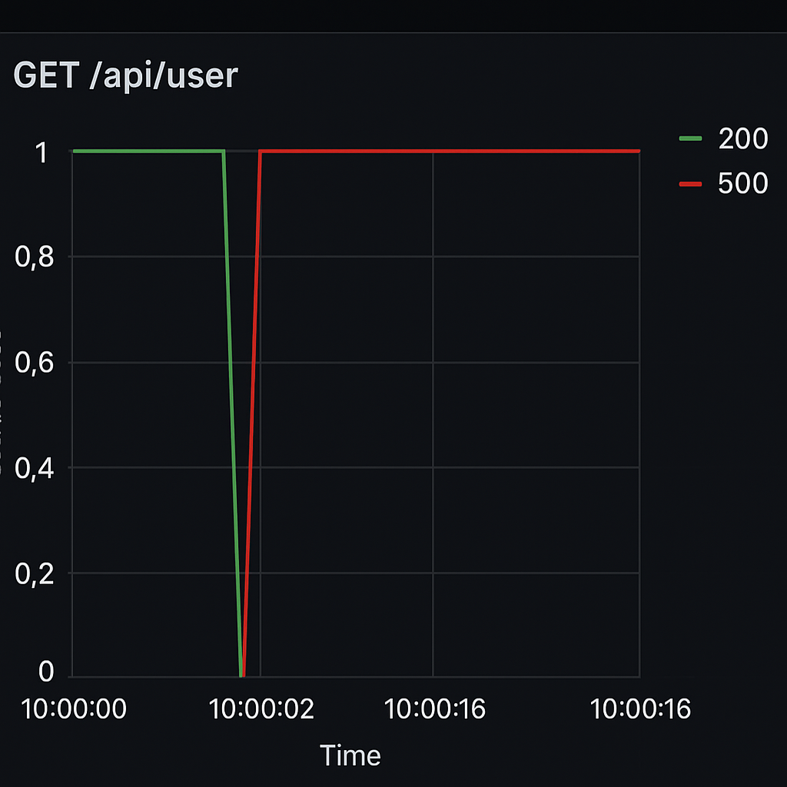

# Poseidon
An AI agent to investigate production outages (and soon minimize impact!)

## Current Scope
This is literally v0.0.1, and the concept works. I plan to add MCP, a more flexible schema for the API, and overall just make it more universal - so feedback is critical. Please create issues or email me directly: harshad.gm@gmail.com

Kind of vibe coded my way through this, so it just works. Lot of things I'll clean up in the next version.

## How to run
Use the config.yaml file to set up
- a Postgres store
- HTTP info for getting incidents, operations, logs and metrics
- API key for Anthropic and configure the model for analysis
- configure a webhook (like your own service) which can receive a payload (forward to Slack, etc)

<b>Poseidon uses AI to convert responses from your APIs to standard formats it can process. It doesn't matter how you return the operation records or logs or metrics.</b>

## What's next?
1. Use greptile or some way to search your codebase
2. Search your DB 

## Demo
Imagine a feature flag is turned on for gender based recommendations in a service, and the user API starts to fail because some early users didn't enter their gender and there was no validation on the db column back in the day.



Logs:
```
2025-06-05 10:00:01.042  INFO 12345 --- [nio-8080-exec-4] c.e.repo.InventoryRepository      : SELECT * FROM inventory
2025-06-05 10:00:01.043  INFO 12345 --- [nio-8080-exec-4] c.e.controller.InventoryController: Responding with 200 OK
2025-06-05 10:00:02.001  INFO 12345 --- [nio-8080-exec-5] c.e.controller.UserController     : GET /api/user
2025-06-05 10:00:02.002  INFO 12345 --- [nio-8080-exec-5] c.e.service.UserService           : Fetching user details
2025-06-05 10:00:02.003  INFO 12345 --- [nio-8080-exec-5] c.e.repo.UserRepository           : Executing query: SELECT * FROM users WHERE id=10
2025-06-05 10:00:02.004 ERROR 12345 --- [nio-8080-exec-5] c.e.controller.UserController     : Failed to read `user`.`gender`: java.lang.NullPointerException
2025-06-05 10:00:02.004 ERROR 12345 --- [nio-8080-exec-5] c.e.controller.UserController     : Responding with 500 Internal Server Error
2025-06-05 10:00:02.010  INFO 12345 --- [nio-8080-exec-6] c.e.controller.OrderController    : GET /api/order
2025-06-05 10:00:02.011  INFO 12345 --- [nio-8080-exec-6] c.e.service.OrderService          : Fetching order list
2025-06-05 10:00:02.012  INFO 12345 --- [nio-8080-exec-6] c.e.repo.OrderRepository          : SELECT * FROM orders WHERE user_id=1
2025-06-05 10:00:02.013  INFO 12345 --- [nio-8080-exec-6] c.e.controller.OrderController    : Responding with 200 OK
2025-06-05 10:00:02.020  INFO 12345 --- [nio-8080-exec-7] c.e.controller.ProductController  : GET /api/product
```

Operation records API response:
```json
{
  "status": "success",
  "data": {
    "event_type": "feature_flag_change",
    "flag_name": "genderRecommendations",
    "previous_value": false,
    "new_value": true,
    "changed_by": "feature-admin@company.com",
    "timestamp": "2025-06-05T10:00:02Z",
    "environment": "production",
    "service": "user-service",
    "comment": "Enabled gender-based recommendations for A/B test rollout"
  }
}
```

When all this is fed to Poseidon, this is the response it generates:
```json

```